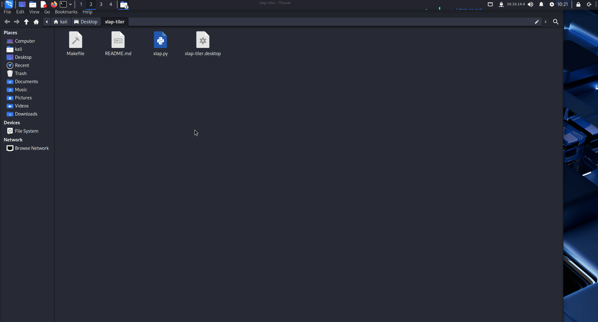

# Xlap-Tiler

A lightweight, context-aware window tiling tool for X11-based Linux desktops, forked from the original `xlap` and enhanced for a more intuitive workflow.



---

## About This Fork

This repository is a fork of the original **[xlap project by sri-at-gitlab](https://gitlab.com/sri-at-gitlab/projects/xlap)**.

This version, forked by **[ghimireaacs](https://github.com/ghimireaacs)**, as **Xlap-Tiler** and refactors its core functionality. Instead of cycling through a long list of layouts, it introduces an intelligent, **context-aware tiling workflow** inspired by modern tiling window managers. Full credit for the foundational code and original concept goes to **sri-at-gitlab**.

### Key Enhancements
-   **Intuitive Tiling**: Use `Super` + `Alt` + `Arrow Keys` to snap windows. The result intelligently changes based on the window's current position.
-   **Two-Step Quadrant Snapping**: Snap a window to a half, then to a corner, with two quick key presses.
-   **Desktop Integration**: Renamed to `Xlap-Tiler` to establish a clear, separate identity.

---

## System Compatibility

Xlap-Tiler is designed and tested to work on **Debian-based Linux distributions**. This is because its dependencies are listed for the `apt` package manager and it relies on `AyatanaAppIndicator` for its system tray icon, which is standard on these systems.

This includes, but is not limited to:
-   Debian
-   Ubuntu (and its flavors like Kubuntu, Xubuntu)
-   Kali Linux
-   Linux Mint
-   Pop!_OS

Users of other distributions (like Fedora or Arch Linux) may be able to adapt the dependencies and install it manually.

---

## Installation

### 1. Install Dependencies

Open a terminal and run the following command to install the required packages.

```bash
sudo apt update
sudo apt install python3-gi python3-pynput gir1.2-gtk-3.0 \
                 gir1.2-ayatanaappindicator3-0.1 xdotool libnotify-bin
```

## 2. Install Xlap-Tiler

Clone this repository, `cd` into the project directory, and run the `make install` command.


```bash
git clone [https://github.com/ghimireaacs/xlap-tiler.git](https://github.com/ghimireaacs/xlap-tiler.git)
cd xlap-tiler
sudo make install
```

This will install the script to `/usr/bin/xlap-tiler` and add an "Xlap-Tiler" entry to your application menu.

---

## USAGE

Launch Xlap-Tiler from your application menu. A grid icon will appear in your system tray, indicating that the hotkeys are active.

### Tiling Shortcuts
The primary workflow uses `Super` + `Alt` + `Arrow Keys`.

| Shortcut | If Window is Maximized/Floating | If Window is already 50% Left | If Window is already 50% Top |
| Super + Alt + → | Snaps to 50% Right | No change | Snaps to Top Right Corner |
| Super + Alt + ↓ | Snaps to 50% Bottom | Snaps to Bottom Left Corner | No change |
| ...and so on for all combinations. |  |  |  |

### Other Actions

- Run On Startup: Add "Xlap-Tiler" to your desktop's startup applications manager to run it automatically on login.
- Configuration: Manually edit margins by opening `~/.xlap-tiler-conf.json`. You can access this file from the system tray menu (`Settings...`).
- Uninstall: To remove the application, `cd` back into the project directory and run `sudo make uninstall`.


# Credits

- Original Author: This project is based on the foundational 
- Maintained: 
